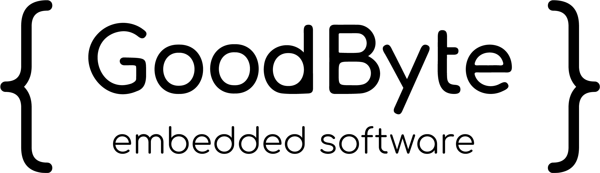
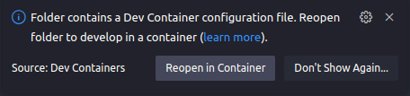
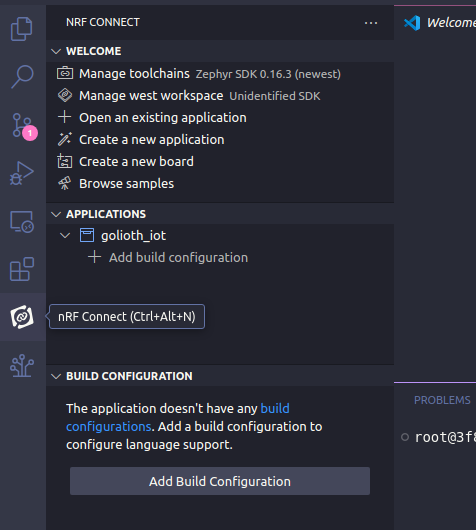
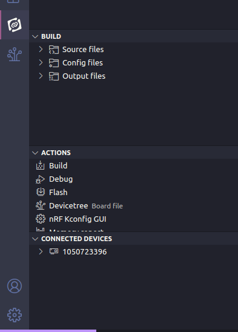
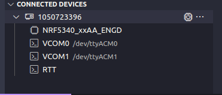
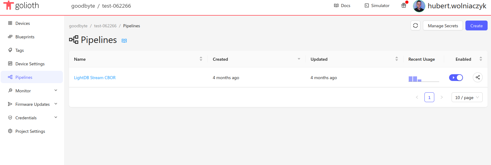
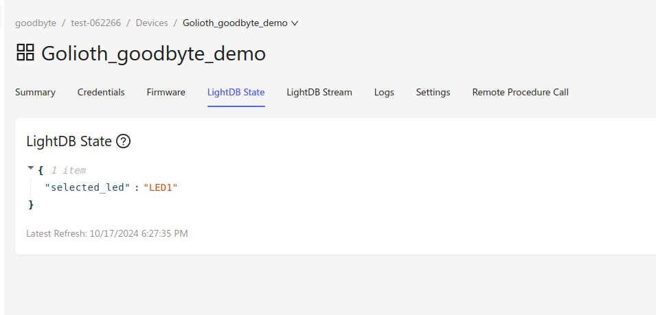

Golioth demo repository - Goodbyte Software
#######################

This is an adapted version of this `Golioth Zephyr training example <https://github.com/golioth/zephyr-training/tree/1d8840429516d862fb71c21c833e6e283d705927/01_IOT>`_

It has been modified by Goodbyte Software for educational purposes. 
The original project is licensed under the Apache License 2.0, and any `changes <https://github.com/goodbyte-software/golioth_demo/compare/init...master?expand=1>`_ have been made in accordance with this license.

Our goal was to facilitate a quick start with Golioth, using Visual Studio Code and Dev Containers.

In fact, after cloning this repository and creating an account on Golioth, you should be able to run this Golioth project in few simple steps.

This README helps to install GoliothSDK properly with our demo.

Boards
======

Demo is currently working with nRF7002-DK.

Docker
******

We are using base image from Golioth with our features needed for flashing and working with VSCode nRF Extension. 

Step 1. Use Docker to initialize workspace
==========================================

1.1 Clone repository to your local machine.

1.2 Open project in VSCode then run it as devcontainer - there should be window pop up when u open project that contains .devcontainer directory(image below) or you can do it manually with VSCode terminal (>Dev Containers). 

1.3 Give it some time :)

Step 2. Build & flash
=====================

2.1 When devcontainer is running and build is finished you should see nRF extension icon on your left panel - click it. 

2.2 Add build configuration and choose nrf7002dk_nrf5340_cpuapp from the board target list.

2.3 Leave all settings by default and build configuration by click the button bellow. 

2.4 When build is finished actions bar appears, first of all lets flash our board.

The alternative way is to use terminal 

.. code-block:: console

   cd golioth_iot
   west build --board nrf7002dk_nrf5340_cpuapp --pristine
   west flash

Step 3. Connecting to Golioth
=============================

3.1 Create your project on Golioth Cloud, I suggest reading this guide:

`Getting started guide from Golioth <https://docs.golioth.io/getting-started/>`_

3.2 Under the actions bar expand your target board and choose VCOM1(ttyACM1)

3.2 Connect to Golioth by using terminal. 

.. code-block:: bash

   uart:~$ settings set wifi/ssid <my-wifi-ap-ssid>
   uart:~$ settings set wifi/psk <my-wifi-ap-password>
   uart:~$ settings set golioth/psk-id <my-psk-id@my-project>
   uart:~$ settings set golioth/psk <my-psk>
   uart:~$ kernel reboot cold

3.1 If your credentials were correct you should be able to see some logs: 

.. code-block::

   [00:00:26.067,321] <inf> golioth_iot: Hello Golioth! 1
   [00:00:26.067,382] <inf> golioth_iot: Streaming Temperature to Golioth: 27.270000
   [00:00:26.283,416] <dbg> golioth_iot: temperature_push_handler: Temperature successfully pushed

Step 4. Working with Golioth console
====================================

4.1 Check if you have any pipeline added, if not create one with 

.. code-block::

   filter:
     path: "*"
     content_type: application/cbor
   steps:
     - name: step-0
       transformer:
         type: cbor-to-json
         version: v1
       destination:
         type: lightdb-stream
         version: v1

4.2 Navigate to your device panel and choose LightDB State tab, press buttons to see state updating. 

4.3 Check other tabs to see data send by device. 

4.4 Use remote procedure call to get information about the network to which the device is connected. 

.. code-block::

   get_network_info

Explanation
===========
We are combining manifest files and devcontainers to simplify process of development. 
Manifest files gives us control which Zephyr/nRF/Golioth dependencies should be installed. 
Devcontainers provide us ubuntu based development system that is easily reproduced and maintained. 

References
==========
`<https://github.com/golioth/zephyr-training>`_

`<https://www.nordicsemi.com/Products/Development-hardware/nRF7002-DK>`_

📜 License
This project is licensed under Apache-2.0 same as the original project.

